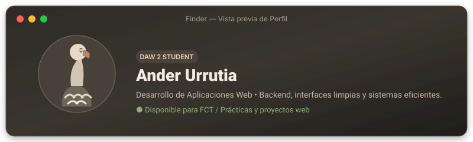
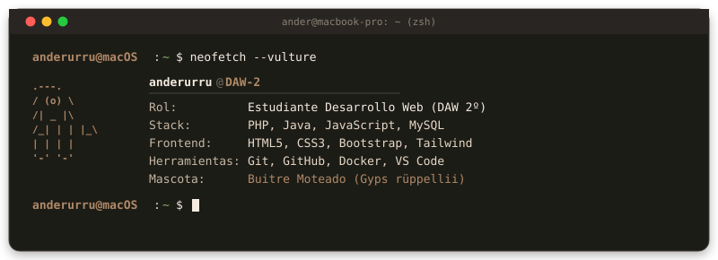

  

  

  

 

---

### 🗂️ Finder — Proyectos Destacados (DAW 2)

| Proyecto | Descripción | Stack | Estado |
| :--- | :--- | :---: | :---: |
| 🦅 **[Proyecto DAW 1: Gestión Web](https://github.com/anderurru)** | Aplicación web fullstack con autenticación y panel de control. | `PHP` `MySQL` `CSS3` | `Completado` |
| ⚡ **[Proyecto DAW 2: Proyecto Final / FCT](https://github.com/anderurru)** | Plataforma con consumo de APIs RESTful y servicios web. | `Java` `Spring` `JS` | `En curso` |
| 🛠️ **[Portfolio Desktop macOS](https://github.com/anderurru/anderurru)** | Perfil temático de escritorio macOS con identidad de buitre moteado. | `SVG` `Markdown` | `v1.0` |

 

---

### 📊 Monitor de Actividad (GitHub Stats)

 

---

### 📬 Conectar / Centro de Notificaciones

